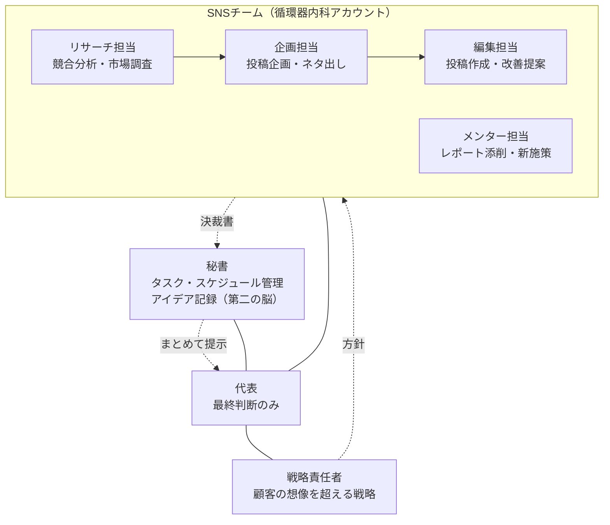

# 岳燈 -gakuto-

代表の仕事を「最終判断だけ」にするための、AI エージェントの会社です。
Claude Code でこのリポジトリを開くと、社内規定（`CLAUDE.md`）と社員（`.claude/agents/`）が読み込まれます。

## 組織



## 代表の使い方

| やりたいこと | 言い方 |
|---|---|
| 決裁待ちを見る・答える | `/decide`（回答は「1はA、2は承認」など一言で） |
| 思いつきを残す | `/idea 高血圧の朝活シリーズやりたい` |
| 週の予定を組む | `/week 来週水曜は休み` |
| 今週の投稿案を作らせる | `/sns-week` |
| メンティーのレポートを添削させる | レポートを `sns/mentor/reports/` に置いて `/mentor <ファイル名>` |
| それ以外 | 普通に話しかければ、窓口が担当に振り分けます |

## フォルダ

```
CLAUDE.md                 社内規定（全エージェント共通ルール・勤務表・決裁書式）
.claude/agents/           社員の職務定義
.claude/commands/         代表用ショートカット
decisions/pending|done/   決裁書（代表が見るのは基本ここだけ）
secretary/                タスク・週次計画・勤務マスター・アイデア
strategy/                 全体方針・戦略メモ
sns/research|plans|drafts SNS チームの成果物
sns/mentor/               メンター業務（reports=原本, reviews=添削, proposals=施策）
```
